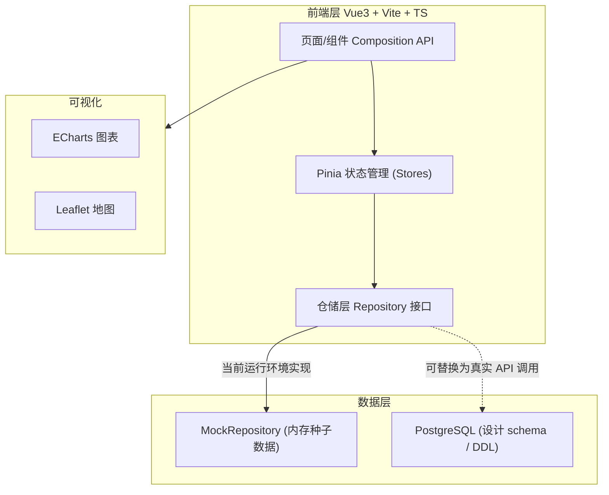
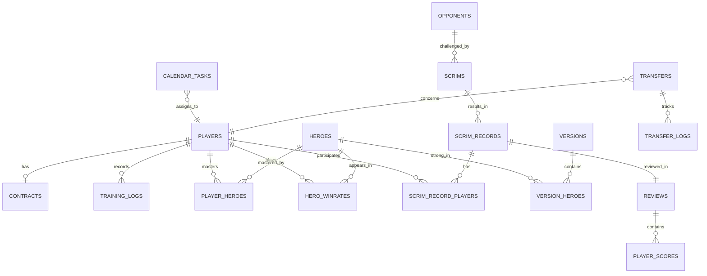

# 技术架构文档 — 职业电竞战队综合管理平台「NEXUS Ops」

## 1. 架构设计



> **数据策略说明**：本仓库为纯前端工程（Vue3 + Vite），运行环境无 PostgreSQL 实例。因此采用「仓储接口 + Mock 实现」模式：`Repository` 接口镜像下方 PostgreSQL schema 的实体与关系，`MockRepository` 提供内存种子数据并模拟 CRUD；前端通过 Pinia store 调用仓储接口。将来接入真实后端时，仅需将 `MockRepository` 替换为基于 `fetch` 的 `ApiRepository`，无需改动 UI 层。

## 2. 技术说明

- **前端**：Vue@3.4 (Composition API, `<script setup lang="ts">`) + Vite@5 + TypeScript
- **样式**：Tailwind CSS@3（`darkMode:'class'`，暗色指挥台主题）
- **状态管理**：Pinia@3
- **路由**：vue-router@4
- **图表**：echarts@6 + vue-echarts@8
- **地图**：leaflet@1.9 + @types/leaflet
- **日期**：date-fns@4
- **图标**：lucide-vue-next
- **工具**：clsx + tailwind-merge（`cn` 合并类名）
- **数据库（设计）**：PostgreSQL（见 §6 DDL）
- **后端**：当前无独立后端；仓储接口可平滑替换为 REST API。

## 3. 路由定义

| 路由 | 页面 | 说明 |
|------|------|------|
| `/` | 指挥中心 Dashboard | 战队全局态势 |
| `/players` | 队员管理-列表 | 选手卡片/表格 + 筛选 |
| `/players/:id` | 队员管理-详情 | 档案/英雄池/合同/训练数据 |
| `/scrims` | 训练赛管理 | 对手 + 记录 + 复盘 Tab |
| `/calendar` | 赛训日历 | 月/周/日视图 |
| `/analytics` | 数据分析 | 胜率矩阵 + 版本英雄 |
| `/transfers` | 转会管理 | 合同到期 + 转会市场 |

## 4. API / 仓储接口定义（TS 类型摘要）

```ts
// 仓储接口示例（UI 层依赖接口，而非实现）
interface PlayerRepository {
  list(filter?: PlayerFilter): Promise<Player[]>
  get(id: string): Promise<Player | null>
  create(data: PlayerInput): Promise<Player>
  update(id: string, data: Partial<PlayerInput>): Promise<Player>
  remove(id: string): Promise<void>
}
// 同理：ContractRepository / TrainingLogRepository / ScrimRepository /
// ScrimRecordRepository / ReviewRepository / CalendarTaskRepository /
// HeroWinrateRepository / VersionHeroRepository / TransferRepository
```

## 5. 数据模型



## 6. 数据定义语言（PostgreSQL DDL）

```sql
-- 版本与英雄
CREATE TABLE versions (
  id           SERIAL PRIMARY KEY,
  code         VARCHAR(16) UNIQUE NOT NULL,      -- e.g. '14.10'
  release_date DATE NOT NULL,
  is_current   BOOLEAN DEFAULT FALSE
);

CREATE TABLE heroes (
  id           SERIAL PRIMARY KEY,
  name         VARCHAR(64) UNIQUE NOT NULL,
  role         VARCHAR(16) NOT NULL,             -- top/jng/mid/adc/sup
  icon         VARCHAR(128)
);

CREATE TABLE version_heroes (
  id           SERIAL PRIMARY KEY,
  version_id   INT REFERENCES versions(id) ON DELETE CASCADE,
  hero_id      INT REFERENCES heroes(id) ON DELETE CASCADE,
  tier         VARCHAR(8) NOT NULL,              -- S/A/B
  UNIQUE(version_id, hero_id)
);

-- 选手
CREATE TABLE players (
  id            SERIAL PRIMARY KEY,
  handle        VARCHAR(64) UNIQUE NOT NULL,    -- 游戏ID
  real_name     VARCHAR(64),
  age           INT,
  nationality   VARCHAR(48),
  country_code  VARCHAR(3),                       -- ISO 用于地图
  position      VARCHAR(16) NOT NULL,            -- top/jng/mid/adc/sup
  join_date     DATE,
  status        VARCHAR(16) DEFAULT 'active',    -- active/benched/training
  avatar        VARCHAR(128)
);

CREATE TABLE player_heroes (
  id           SERIAL PRIMARY KEY,
  player_id    INT REFERENCES players(id) ON DELETE CASCADE,
  hero_id      INT REFERENCES heroes(id) ON DELETE CASCADE,
  mastery      INT NOT NULL DEFAULT 0,           -- 0-100 熟练度
  UNIQUE(player_id, hero_id)
);

CREATE TABLE contracts (
  id             SERIAL PRIMARY KEY,
  player_id      INT REFERENCES players(id) ON DELETE CASCADE,
  start_date     DATE NOT NULL,
  end_date       DATE NOT NULL,
  salary_monthly NUMERIC(12,2) NOT NULL,          -- 薪资(敏感)
  bonus          NUMERIC(12,2) DEFAULT 0,        -- 奖金结构
  years          INT NOT NULL,
  transfer_clause TEXT,                          -- 转会条款
  buyout         NUMERIC(14,2),                  -- 违约金(敏感)
  status         VARCHAR(16) DEFAULT 'active'    -- active/expiring/expired
);

CREATE TABLE training_logs (
  id            SERIAL PRIMARY KEY,
  player_id     INT REFERENCES players(id) ON DELETE CASCADE,
  log_date      DATE NOT NULL,
  rank_points   INT DEFAULT 0,                   -- 当日rank分
  rank_games    INT DEFAULT 0,
  scrim_games   INT DEFAULT 0
);

CREATE TABLE hero_winrates (
  id           SERIAL PRIMARY KEY,
  player_id    INT REFERENCES players(id) ON DELETE CASCADE,
  hero_id      INT REFERENCES heroes(id) ON DELETE CASCADE,
  opponent_id  INT REFERENCES opponents(id) ON DELETE CASCADE,
  wins         INT DEFAULT 0,
  games        INT DEFAULT 0,
  UNIQUE(player_id, hero_id, opponent_id)
);

-- 对手与训练赛
CREATE TABLE opponents (
  id           SERIAL PRIMARY KEY,
  name         VARCHAR(64) NOT NULL,
  region       VARCHAR(48),
  city         VARCHAR(64),
  latitude     DOUBLE PRECISION,
  longitude    DOUBLE PRECISION,
  contact      VARCHAR(64)
);

CREATE TABLE scrims (
  id           SERIAL PRIMARY KEY,
  opponent_id  INT REFERENCES opponents(id) ON DELETE CASCADE,
  scheduled_at TIMESTAMP NOT NULL,
  status       VARCHAR(16) DEFAULT 'pending'    -- pending/confirmed/done/canceled
);

CREATE TABLE scrim_records (
  id             SERIAL PRIMARY KEY,
  scrim_id       INT REFERENCES scrims(id) ON DELETE CASCADE,
  our_score      INT NOT NULL,
  opp_score      INT NOT NULL,
  result         VARCHAR(8) NOT NULL,            -- WIN/LOSS/DRAW
  notes          TEXT
);

CREATE TABLE scrim_record_players (
  id              SERIAL PRIMARY KEY,
  scrim_record_id INT REFERENCES scrim_records(id) ON DELETE CASCADE,
  player_id       INT REFERENCES players(id) ON DELETE CASCADE,
  hero_id         INT REFERENCES heroes(id),
  kda             VARCHAR(16),
  performance     INT                            -- 0-100
);

CREATE TABLE reviews (
  id               SERIAL PRIMARY KEY,
  scrim_record_id  INT REFERENCES scrim_records(id) ON DELETE CASCADE,
  coach            VARCHAR(64),
  notes            TEXT,
  created_at       TIMESTAMP DEFAULT NOW()
);

CREATE TABLE player_scores (
  id          SERIAL PRIMARY KEY,
  review_id   INT REFERENCES reviews(id) ON DELETE CASCADE,
  player_id   INT REFERENCES players(id) ON DELETE CASCADE,
  score       NUMERIC(4,1) NOT NULL,
  criterion   VARCHAR(48)                                -- 评分标准(可自定义)
);

-- 赛训日历
CREATE TABLE calendar_tasks (
  id           SERIAL PRIMARY KEY,
  player_id    INT REFERENCES players(id) ON DELETE CASCADE,
  title        VARCHAR(128) NOT NULL,
  type         VARCHAR(24) NOT NULL,            -- scrim/rank/fitness/psych/media
  start_at     TIMESTAMP NOT NULL,
  end_at       TIMESTAMP,
  target_value INT,                             -- Rank任务目标(分)
  current_value INT DEFAULT 0,
  reminder     BOOLEAN DEFAULT FALSE,
  remind_at    TIMESTAMP,
  status       VARCHAR(16) DEFAULT 'todo'       -- todo/doing/done
);

-- 转会
CREATE TABLE transfers (
  id            SERIAL PRIMARY KEY,
  player_id     INT REFERENCES players(id) ON DELETE CASCADE,
  type          VARCHAR(16) NOT NULL,           -- list/trial/renew/negotiate
  status        VARCHAR(16) DEFAULT 'open',     -- open/trialing/done/failed
  ask_price     NUMERIC(14,2),
  city          VARCHAR(64),
  latitude      DOUBLE PRECISION,
  longitude     DOUBLE PRECISION
);

CREATE TABLE transfer_logs (
  id           SERIAL PRIMARY KEY,
  transfer_id  INT REFERENCES transfers(id) ON DELETE CASCADE,
  event        VARCHAR(48) NOT NULL,           -- 挂牌/试训安排/报价/还价/成交
  amount       NUMERIC(14,2),
  note         TEXT,
  created_at   TIMESTAMP DEFAULT NOW()
);

-- 索引
CREATE INDEX idx_contracts_end_date ON contracts(end_date);
CREATE INDEX idx_training_logs_date ON training_logs(player_id, log_date);
CREATE INDEX idx_calendar_tasks_start ON calendar_tasks(start_at);
CREATE INDEX idx_hero_winrates ON hero_winrates(player_id, hero_id);
```

## 7. 前端目录结构

```
src/
  assets/            # logo / 图形
  components/        # 通用组件 (BaseCard, StatCard, Badge, ProgressBar, Modal...)
  layout/            # AppLayout (侧栏 + 顶栏)
  composables/        # useTheme, useChart, useLeafletMap, usePermission...
  data/
    types.ts         # 镜像 PostgreSQL schema 的 TS 类型
    seed.ts          # 内存种子数据
    repositories.ts  # MockRepository 实现
  stores/            # players, contracts, scrims, calendar, analytics, transfers
  pages/
    dashboard/  players/  scrims/  calendar/  analytics/  transfers/
  lib/               # utils (cn 等), echarts 注册
  router/            # index.ts
  main.ts / App.vue / style.css
```

## 8. 安全与权限

- 仓储层与 store 通过 `usePermission()` 组合式函数对敏感字段（薪资、违约金、合同条款）按角色脱敏。
- 前端仅为演示，不含真实鉴权；接入真实后端时应由服务端做权限校验，前端脱敏仅为体验层补充。
