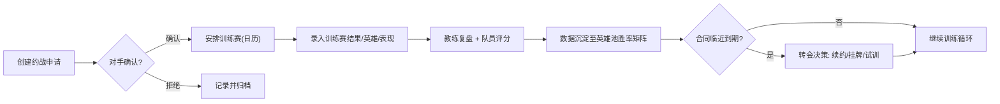

# 产品需求文档（PRD）— 职业电竞战队综合管理平台「NEXUS Ops」

## 1. 产品概述

面向职业电竞战队教练组、管理层与数据分析师的一体化「战术作战指挥台」，将选手档案与合同、训练赛全流程、赛训日历、数据分析与转会管理整合为单一数据驱动决策中枢。
- 解决问题：散落在表格/聊天记录中的选手数据、合同、训练赛与转会信息难以联动分析与预警。
- 目标用户：战队主教练、领队、数据分析师、俱乐部经理。
- 市场价值：提升战队运营效率、训练科学性与转会决策质量，降低合同到期/违约风险。

## 2. 核心功能

### 2.1 用户角色

| 角色 | 登录方式 | 核心权限 |
|------|----------|----------|
| 教练组 | 账号密码 | 全部模块读写；赛后复盘评分；赛训日历管理 |
| 管理层 | 账号密码 | 合同/转会/薪资查看与审批；敏感数据脱敏可见 |
| 数据分析师 | 账号密码 | 数据分析、训练数据只读 + 导出 |
| 选手 | 账号密码 | 查看个人训练数据、个人日历与合同（薪资脱敏） |

> 权限控制：薪资结构、合同条款、违约金等敏感字段按角色脱敏（管理层/教练组可见全量，选手/分析师仅可见概览）。

### 2.2 功能模块

1. **指挥中心仪表盘（Dashboard）**：战队全局态势一览。
2. **队员管理**：选手档案、合同、训练数据追踪。
3. **训练赛管理**：约战对手、训练赛记录、复盘评分。
4. **赛训日历**：多类型任务调度与提醒。
5. **数据分析**：英雄池胜率矩阵、版本英雄掌握进度。
6. **转会管理**：合同到期预警、转会市场流程。

### 2.3 页面详情

| 页面 | 模块 | 功能描述 |
|------|------|----------|
| 指挥中心 | KPI 概览 | 队员数、在岗合同数、近 7 日训练赛胜率、待办日程数 |
| 指挥中心 | 训练趋势 | 全队每日 rank 量 / 训练赛场次折线图（ECharts） |
| 指挥中心 | 合同预警 | 即将到期合同卡片列表（颜色分级预警） |
| 指挥中心 | 队员国籍分布 | Leaflet 地图标注队员国籍与俱乐部驻地 |
| 指挥中心 | 最近训练赛 | 最近训练赛结果卡片 |
| 队员管理 - 列表 | 选手卡片/表格 | 搜索、筛选（位置/国籍）、状态徽章；增删改查入口 |
| 队员管理 - 详情 | 基础信息 | 年龄、国籍、游戏位置、擅长英雄池（可编辑表单） |
| 队员管理 - 详情 | 英雄池可视化 | 英雄熟练度雷达图 / 柱状图（ECharts） |
| 队员管理 - 详情 | 合同档案 | 签约时间、薪资结构、年限、转会条款、违约金；到期预警 |
| 队员管理 - 详情 | 训练数据 | 每日 rank 量、训练赛数据、英雄熟练度趋势；导出 CSV / 历史对比 |
| 训练赛管理 - 对手 | 对手战队管理 | 对手信息 CRUD；约战申请 / 确认流程状态机 |
| 训练赛管理 - 对手 | 对手地理分布 | Leaflet 地图标注对手战队所在地 |
| 训练赛管理 - 记录 | 训练赛记录 | 比分、上场选手、使用英雄、个人表现；新增/编辑/查看 |
| 训练赛管理 - 复盘 | 复盘笔记 | 教练赛后笔记录入；队员表现评分；评分标准自定义 |
| 赛训日历 | 日历视图 | 月 / 周 / 日视图切换；按类型着色 |
| 赛训日历 | 多类型任务 | 训练赛、个人 Rank（进度条，如「本月王者 1000 分」）、体能训练、心理辅导、媒体/直播通告 |
| 赛训日历 | 提醒 | 重要日程提醒机制（站内提醒中心 + 时间标签） |
| 数据分析 | 英雄池胜率矩阵 | 选手 × 英雄 × 对手 胜率热力图；标识最高/最低胜率组合 |
| 数据分析 | 版本英雄掌握 | 当前版本强势英雄的掌握度与学习进度条 |
| 转会管理 | 合同到期时间表 | 到期时间轴 + 预警分级 |
| 转会管理 | 转会市场 | 选手挂牌、试训安排、转会费谈判记录；试训地点 Leaflet 地图 |

## 3. 核心流程

约战 → 训练赛进行 → 赛后复盘评分 → 数据沉淀分析 → 合同/转会决策

## 4. 用户界面设计

### 4.1 设计风格

- **风格方向**：战术作战指挥台（esports command center）——深色、高对比、数据密集、辉光描边，避免泛用「白底紫渐变」AI 套皮。
- **主色板**：
  - 背景 obsidian `#08090d` / 面板 `#0f1117` / 悬浮面板 `#151821`
  - 主强调 acid green `#b6ff3a`（作战/激活态）
  - 次强调 ember `#ff6b35`（预警/危险）
  - 数据蓝 steel `#38bdf8`（数据/信息）
  - 边框 `#232733`、文本主 `#e6e9ef` / 次 `#8b93a7`
- **字体**：
  - 标题/数字：`Chakra Petch`（战术几何感）
  - 正文：`Saira`
  - 数据/代码：`JetBrains Mono`
- **按钮风格**：小圆角（`rounded-md`）、细描边、悬停辉光（`box-shadow` acid glow）；主按钮 acid green 实色。
- **布局风格**：固定左侧导航栏 + 顶栏（战队/角色切换）+ 卡片化主内容区；指挥台栅格。
- **图标风格**：`lucide-vue-next` 线性图标，与数据色板一致。
- **动效**：首屏交错入场（`animation-delay`）、进度条/数字爬升、悬停辉光、状态点呼吸。

### 4.2 页面设计总览

| 页面 | 模块 | UI 元素（风格/布局/颜色/字体/动效） |
|------|------|------|
| 指挥中心 | KPI 卡 | 4 列卡片，大号 Chakra Petch 数字，acid green/ember 上扬趋势 |
| 指挥中心 | 训练趋势 | ECharts 折线，steel 蓝 + acid green 双线，渐变填充 |
| 指挥中心 | 国籍地图 | Leaflet 暗色底图（CartoDB dark），acid green 圆点聚合 |
| 队员管理 | 选手卡片 | 头像 + 位置徽章 + 国旗 + 状态点；悬停辉光位移 |
| 队员管理 | 英雄池 | ECharts 雷达/横向柱状，acid green 渐变 |
| 训练赛管理 | 记录表 | 比分大字 mono，胜负色标，行展开详情 |
| 赛训日历 | 月视图 | 网格，任务类型色条；Rank 任务进度条叠加 |
| 数据分析 | 胜率矩阵 | ECharts 热力图，最高 acid green / 最低 ember |
| 转会管理 | 时间轴 | 垂直时间轴，到期节点分级着色 |

### 4.3 响应式

桌面优先（指挥台宽屏布局），平板自适应收起侧栏为图标条，移动端单列堆叠 + 抽屉导航；触控目标 ≥ 44px。

### 4.4 3D 场景

不适用（本平台为 2D 数据型指挥台）。
